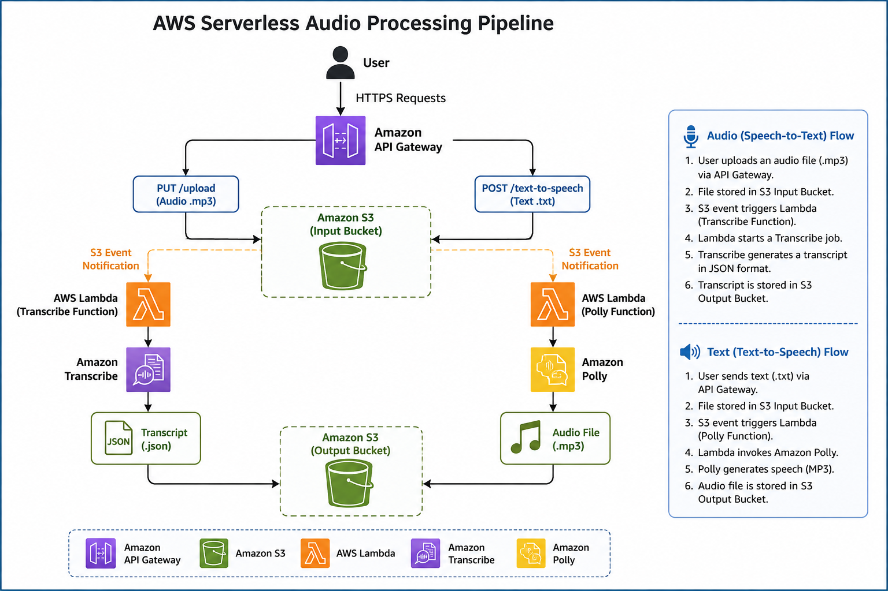

# AWS Serverless Audio Processing Pipeline

##  Project Overview

This project demonstrates a fully event-driven serverless architecture on AWS.

The application provides REST APIs using Amazon API Gateway to upload audio and text files.

- Audio files are automatically converted into text using Amazon Transcribe.
- Text files are automatically converted into speech using Amazon Polly.

The complete workflow is fully serverless using Amazon S3 Event Notifications, AWS Lambda, and managed AWS services.

## Architecture

##  AWS Services Used

- Amazon API Gateway
- Amazon S3
- AWS Lambda
- Amazon Transcribe
- Amazon Polly
- AWS IAM
- Amazon CloudWatch

---

##  Features

- REST API using API Gateway
- Direct Amazon S3 Integration
- Event-Driven Architecture
- Speech-to-Text using Amazon Transcribe
- Text-to-Speech using Amazon Polly
- AWS Lambda Automation
- API Key Authentication
- CloudWatch Logging
